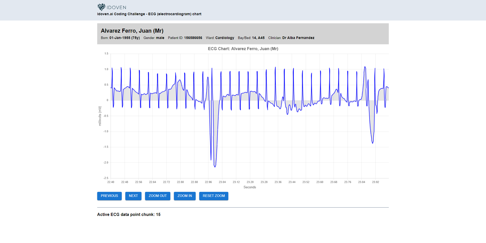

# IDOVEN React Coding Challenge

## Table of Contents

- Implemented NodeJS / Express API to parse and chunk the large (1.5GB) raw data file into streamed API chunks for client performance
- Used file `14-29-05_data_data.txt` per `https://github.com/idoven/frontend-challenge/tree/main/data` - added to .gitattributes as lfs
- Assuming, based on dataset, the raw values are represented as microvolts (uV).In clinical settings, from my experience, it is more common to display ECG data in millivolts (mV) than in microvolts (uV)
- Added two API routes - `/api/ecg-data` and `/api/patient`
- Added socket.io websocket support to support data streaming from API layer to React client
- Added Chart.Js to render ECG
- Added mocked patient Banner and patient object
- Implemented Context API / Provider and hooks to demonstrate - returns patient data (static) from API
- Used React Functional Components
- Used TypeScript throughout application
- Added Jest Tests (2 Test Suites and 5 tests) to demonstrate
- Used Vite
- Added Material UI / Tailwind and Emotion styled components to demonstrate the dofferent approaches available in thes demo app
- Created child components in a reusable way throughout

## Installation and Usage

1. Clone the repository: `git clone https://github.com/your-username/project.git`
2. Navigate to the project directory: `cd project`
3. Install the dependencies: `npm install`
4. Run `npm run dev` to build and run locally (frontend starts on port 3000, backend API on 3001)
5. Run `npm test` to run unit tests
